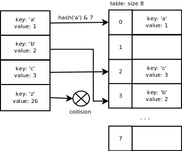
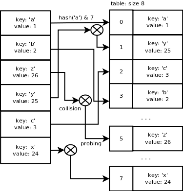
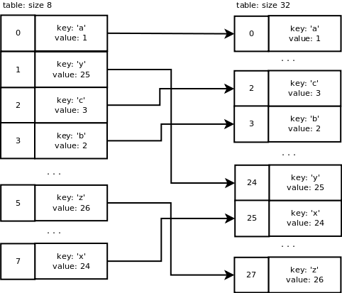
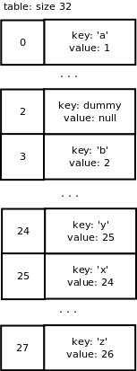

# 【译】Python字典实现

***

原文链接：[python-dictionary-implementation](http://www.laurentluce.com/posts/python-dictionary-implementation/)

***

这篇文章描述了在Python中字典是如何实现的。

字典通过键(<code>key</code>)来索引，它可以被看做是关联数组。我们在一个字典中添加3个键/值对：

``` Python
>>> d = {'a': 1, 'b': 2}
>>> d['c'] = 3
>>> d
{'a': 1, 'b': 2, 'c': 3}
```

可以这样访问字典值：

``` Python
>>> d['a']
1
>>> d['b']
2
>>> d['c']
3
>>> d['d']
Traceback (most recent call last):
    File "<stdin>", line 1, in <module>
KeyError: 'd'
```

键'd'不存在，所以抛出了KeyError异常。

哈希表
===

Python字典是用哈希表(``hash table``)实现的。哈希表是一个数组，它的索引是对键运用哈希函数(``hash function``)求得的。哈希函数的作用是将键均匀地分布到数组中，一个好的哈希函数会将冲突（译者注：冲突指不同键经过哈希函数计算得到相同的索引，这样造成索引重复的冲突。）的数量降到最小。Python没有这类哈希函数，它最重要的哈希函数（用于字符串和整数）很常规：

``` Python
>>> map(hash, (0, 1, 2, 3))
[0, 1, 2, 3]
>>> map(hash, ("namea", "nameb", "namec", "named"))
[-1658398457, -1658398460, -1658398459, -1658398462]
```

在这篇文章的余下部分里，我们假定用字符串作为字典的键。Python中字符串的哈希函数定义如下：

```
arguments: string object
return: hash
function: string_hash:
    if hash cached:
        return it
    set len to string's length
    initialize var p ponting to 1st char of string object
    set x to value pointed by p left shifted by 7 bits
    while len >= 0:
        set var x to (1000003 * x) xor value pointed by p
        increment pointer p
    set x to x xor length of string object
    cached x as the hash so we don't need to calculate it again
    return x as the hash
```

如果你在Python中运行 hash('a')，string_hash()函数将会被执行并返回12416037344。这里我们假定我们使用的时64位机器。（译者注：这篇文章讲述的是Python2的字典实现）

如果一个长度为x的数组被用来存储键/值对，那么我们用``x-1``作为掩码来计算数组中slot的索引，这使得计算slot索引的计算非常快。找到一个空slot的概率很大，原因是下述调整大小的机制。这意味着在绝大多数情况下使用简单的计算是很有意义的。如果数组的大小是8，那么'a'的索引将会是``hash('a') & 7 = 0``。``'b'``的索引是3，``'c'``的索引是2，``'z'``的索引和``'b'``一样都是3因此便产生了冲突。



我们可以看到当键是连续的时候，Python的哈希函数能很好地运作，因为这类数据极为常见。然而，当我们添加了键``'z'``冲突就产生了，因为它（译者注：这里是指这些key经过哈希函数计算得到的索引）不够连续。

我们可以使用一个``链表(linked list)``来存储hash值相同的键/值对，但是这样会增加查找的时间复杂度（再也不是``O(1)``了）。下面的部分描述了Python字典中用到的冲突解决方法。

开放地址法
===

开放地址法是一个用探测手段来解决冲突的方法。在上述``'z'``键的例子中，索引为3的slot在数组中已经被使用了，因此我们需要探测出一个尚未被占用的索引。因为需要探测，所以添加一个键/值对可能需要更多的时间，但是查找却是O(1)时间复杂度的，这正是我们诉求的。

二次探查序列是用来查找空闲slot的，代码如下：

```
j = (5 * j) + 1 + perturb;
perturb >>= PERTURB_SHIFT;
use j % 2 ** i as the next table index;
```

你可以在源代码[dictobject.c](http://svn.python.org/projects/python/trunk/Objects/dictobject.c)中找到更多关于探测序列的内容。详细的探测机制的解释在源码的头部。


现在让我们顺着一个例子来看看Python实现的源码。

字典的C数据结构
===

下面的C结构被用来存储一个字典项：键/值对。哈希值、键和值都存储在这个结构中。``PyObject``是Python对象的基类（译者注：这里只是类的概念，CPython用C结构体抽象出了Python中的类概念）。

``` c
typedef struct {
    Py_ssize_t me_hash;
    PyObject *me_key;
    PyObject *me_value;
} PyDictEntry;
```

下面的结构代表了一个字典。``ma_fill``是使用了的slots加dummy slots的数量和。当一个键值对被移除了时，它占据的那个slot（译者注：slot一般翻译为“槽”，个人比较喜欢直接用英文，通俗地讲它就是指一个抽象的存储位置）会被标记为dummy。``ma_used``是被占用了（即活跃的）的slots数量。``ma_mask``等于数组长度减一，它被用来计算slot的索引。``ma_table``是一个（用来存键值对）的数组，``ma_smalltable``是一个初始大小为8的数组。

``` c
typedef struct _dictobject PyDictObject;
struct _dictobject {
    PyObject_HEAD
    Py_ssize_t ma_fill;
    Py_ssize_t ma_used;
    Py_ssize_t ma_mask;
    PyDictEntry *ma_table;
    PyDictEntry *(*ma_lookup)(PyDictObject *mp, PyObject *key, long hash);
    PyDictEntry ma_smalltable[PyDict_MINSIZE];
};
```

字典的初始化
===

当你第一次创建一个字典，``PyDict_New()``函数会被调用。下面是精简了源码的伪码实现（它集中于原实现的关键点）

```
returns new dictionary object
function PyDict_New:
    allocate new dictionary object
    clear dictionary's table
    set dictionary's number of used slots + dummy slots (ma_fill) to 0
    set dictionary's number of active slots (ma_used) to 0
    set dictionary's mask (ma_value) to dictionary size - 1 = 7
    set dictionary's lookup function to lookdict_string
    return allocated dictionary object
```

添加项
===

当添加一个新键值对时``PyDict_SetItem()``被调用，该函数带一个指向字典对象的指针和一个键值对作为参数。它检查该键是否为字符串并计算它的hash值（如果这个键的哈希值已经被缓存了则用缓存值）。然后``insertdict()``函数被调用来添加新的键/值对，如果使用了的slots和dummy slots的总量超过了数组大小的2/3则重新调整字典的大小。

为什么事2/3？这是为了保证探测数列可以快速地找到可用的空slot（译者注：个人理解是如果空闲量较大，那么每次探测产生冲突的概率就会降低，从而减少探测次数）。稍候我们再看调整大小的函数。

```
arguments: dictionary, key, value
return: 0 if OK or -1
function PyDict_SetItem:
    if key's hash cached:
        use hash
    else:
        calculate hash
    call insertdict with dictionary object, key, hash and value
    if key/value pair added successfully and capacity orver 2/3:
        call dictresize to resize dictionary's table
```

``insertdict()``使用查找函数``lookdict_string``来寻找空闲的slot，这和寻找key的函数是一样的。``lookdict_string()``函数利用hash和mask值计算slot的索引，如果它不能在slot索引（=hash & mask）中找到这个key，它便开始如上述伪码描述循环来探测直到找到一个可用的空闲slot。第一次探测时，如果key为空(null)，那么如果找到了dummy slot则返回之。这给了之前删除的slots以重用的优先级。

如果我们想添加这样的一些键/值对：{'a': 1, 'b': 2, 'z': 26, 'y': 25, 'c': 5, 'x': 24}，情形如下：
一个字典结构里的表大小为8。

```
PyDict_SetItem: key='a', value = 1
    hash = hash('a') = 12416037344
    insertdict
        lookdict_string
            slot index = hash & mask = 12416037344 & 7 = 0
            slot 0 is not used so return it
        init entry at index 0 with key, value and hash
        ma_used = 1, ma_fill = 1
PyDict_SetItem: key='b', value = 2
    hash = hash('b') = 12544037731
    insertdict
        lookdict_string
            slot index = hash & mask = 12544037731 & 7 = 3
            slot 3 is not used so return it
        init entry at index 3 with key, value and hash
        ma_used = 2, ma_fill = 2
PyDict_SetItem: key='z', value = 26
    hash = hash('z') = 15616046971
    insertdict
        lookdict_string
            slot index = hash & mask = 15616046971 & 7 = 3
            slot 3 is used so probe for a different slot: 5 is free
        init entry at index 5 with key, value and hash
        ma_used = 3, ma_fill = 3
PyDict_SetItem: key='y', value = 25
    hash = hash('y') = 15488046584
    insertdict
        lookdict_string
            slot index = hash & mask = 15488046584 & 7 = 0
            slot 0 is used so probe for a different slot: 1 is free
        init entry at index 1 with key, value and hash
        ma_used = 4, ma_fill = 4
PyDict_SetItem: key='c', value = 3
    hash = hash('c') = 12672038114
    insertdict
        lookdict_string
            slot index = hash & mask = 12672038114 & 7 = 2
            slot 2 is not used so return it
        init entry at index 2 with key, value and hash
        ma_used = 5, ma_fill = 5
PyDict_SetItem: key='x', value = 24
    hash = hash('x') = 15360046201
    insertdict
        lookdict_string
            slot index = hash & mask = 15360046201 & 7 = 1
            slot 1 is used so probe for a different slot: 7 is free
        init entry at index 7 with key, value and hash
        ma_used = 6, ma_fill = 6
```

目前为止，一切看起来像这样：



8个slots中的6个已经被使用了，这超过了数组容量的2/3，``dictresize()``函数会被调用来分配一个更大的数组。这个函数也负责将旧表中的数据复制到新表中。

在这里，``dictresize()``函数会带一个``minused=24``的参数，24是``4 * ma_used``。当已使用的slots量很大时（超过50000），``minused=2 * ma_used``。为什么是已使用slots量的4倍？这样会减小重新调整字典大小的步骤并使字典更稀疏（译者注：这样就可以降低探测时冲突的概率）。

新表的大小需要大于24，这是通过将当前表大小向左移位来实现的，每次左移一位直到它大于24，结果表大小变为了32（即8 -> 16 -> 32）。

这就是重新调整表大小的结果：分配了一个大小为32的新表，旧表的项利用新掩码31（即32 - 1）计算哈希从而插到新表的相应slots中。结果看起来像这样：



移除项
===

``PyDict_DelItem()``被用来删除一个字典项。key的哈希值被计算出来作为查找函数的参数，删除后这个slot就成为了dummy slot。

假设我们想从字典中移除键'c'，最终我们得到下述数组：



注意删除字典项的操作不会触发数组大小的调整（即使使用slots的数量远小于总slots量）。
